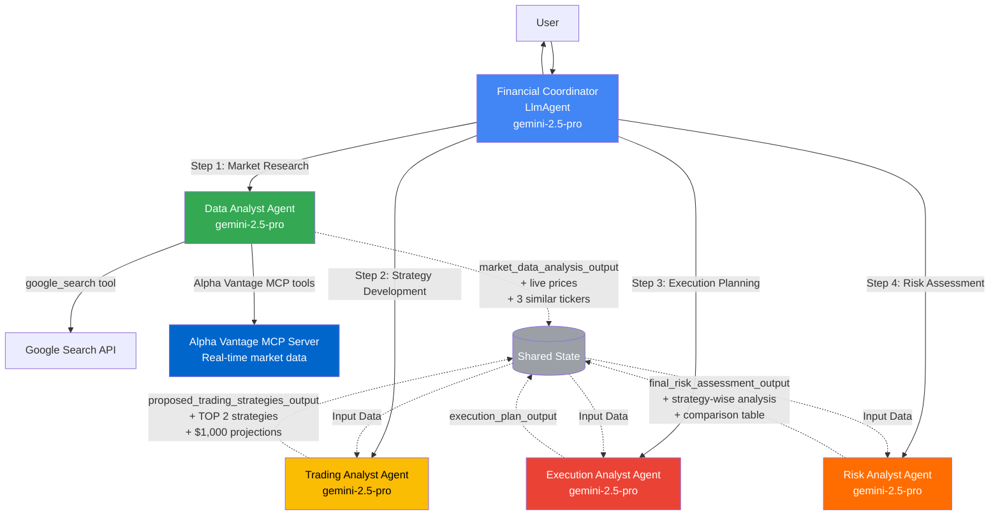

# Financial Advisor Multi-Agent System - Comprehensive Analysis Report

## Executive Summary

The **financial-advisor** project is an AI-driven multi-agent system built using Google's Agent Development Kit (ADK) framework. It provides comprehensive financial advisory services through orchestrated collaboration between one coordinator agent and four specialized sub-agents, all powered by Google's Gemini 2.5 Pro model.

**Key Highlights:**
- 5 specialized agents working in orchestrated sequence
- Educational financial advisory system (not actual investment advice)
- State-based inter-agent communication
- Integration with Google Cloud AI Platform and Vertex AI
- **NEW: Alpha Vantage MCP Server integration for real-time market data**
- **NEW: Live stock price tracking and 3 similar ticker recommendations**
- **NEW: TOP 2 strategy identification with $1,000 investment projections**
- **NEW: Strategy-wise risk analysis for easy comparison**
- Comprehensive testing and evaluation framework

---

## 🆕 Recent Implementation Changes (2025-01-19)

### Summary of Enhancements

This financial-advisor system has been significantly enhanced with the following new capabilities:

1. **✅ Real-Time Market Data Integration**
   - Integrated Alpha Vantage MCP Server for live stock prices
   - Real-time company fundamentals (market cap, P/E ratio, dividend yield)
   - 30-day price history for trend analysis
   - News sentiment analysis with sentiment scores

2. **✅ Similar Ticker Recommendations**
   - Automatically identifies 3 similar stocks by price range (±30%)
   - Matches by sector and market capitalization
   - Provides investment alternatives for diversification

3. **✅ Top 2 Strategy Selection with Investment Projections**
   - Trading Analyst ranks all strategies by expected return
   - Highlights TOP 2 strategies with highest return potential
   - Calculates returns for $1,000 investment across 3 scenarios:
     - Conservative scenario (low-end estimate)
     - Moderate scenario (mid-range estimate)
     - Aggressive scenario (high-end estimate)
   - Includes risk-adjusted metrics (Sharpe ratio, max drawdown, win rate)

4. **✅ Strategy-Wise Risk Analysis**
   - Risk Analyst provides dedicated analysis for each top strategy
   - Comparative risk overview table for quick decision-making
   - Side-by-side risk comparison between Strategy #1 and Strategy #2
   - Final recommendation based on risk-return profile
   - Risk scores contextualized to $1,000 investment

5. **✅ MCP Server Architecture**
   - Alpha Vantage MCP Server with 60+ financial data tools
   - 6 core tools integrated into Data Analyst agent
   - Fallback to Google Search for supplementary research
   - Production-ready with free and premium tiers

### New Files Added

| File | Purpose |
|------|---------|
| `financial_advisor/tools/__init__.py` | Tools module initialization |
| `financial_advisor/tools/alpha_vantage_tools.py` | Alpha Vantage MCP tool definitions (6 tools) |
| `MCP_SERVER_SETUP.md` | Complete setup guide for Alpha Vantage MCP server |
| `IMPLEMENTATION_CHANGES.md` | Detailed documentation of all changes |

### Modified Components

| Component | Changes |
|-----------|---------|
| Data Analyst Agent | Added Alpha Vantage tools, live data fetching, similar ticker finder |
| Trading Analyst Agent | TOP 2 strategy selection, $1,000 investment projections |
| Risk Analyst Agent | Strategy-wise risk organization, comparative analysis |

**📄 For detailed implementation information, see:** `IMPLEMENTATION_CHANGES.md`

**⚙️ For Alpha Vantage setup instructions, see:** `MCP_SERVER_SETUP.md`

---

## Table of Contents

1. [Project Architecture](#project-architecture)
2. [Multi-Agent Collaboration Diagram](#multi-agent-collaboration-diagram)
3. [Agent Details and Tools](#agent-details-and-tools)
4. [Step-by-Step Workflow](#step-by-step-workflow)
5. [Code Walkthrough](#code-walkthrough)
6. [Data Flow and State Management](#data-flow-and-state-management)
7. [Testing and Evaluation](#testing-and-evaluation)
8. [Configuration and Deployment](#configuration-and-deployment)

---

## Project Architecture

### Directory Structure

```
financial-advisor/
├── financial_advisor/              # Main application package
│   ├── __init__.py                 # Google Cloud authentication setup
│   ├── agent.py                    # Financial Coordinator (root agent)
│   ├── prompt.py                   # Coordinator instructions (111 lines)
│   └── sub_agents/                 # Specialized sub-agents
│       ├── data_analyst/           # Market data research agent
│       │   ├── __init__.py
│       │   ├── agent.py            # Agent implementation
│       │   └── prompt.py           # Agent instructions
│       ├── trading_analyst/        # Strategy development agent
│       │   ├── __init__.py
│       │   ├── agent.py
│       │   └── prompt.py
│       ├── execution_analyst/      # Execution planning agent
│       │   ├── __init__.py
│       │   ├── agent.py
│       │   └── prompt.py
│       └── risk_analyst/           # Risk assessment agent
│           ├── __init__.py
│           ├── agent.py
│           └── prompt.py
├── tests/
│   └── test_agents.py              # Integration tests
├── eval/
│   ├── test_eval.py                # Evaluation framework
│   └── data/
│       └── financial-advisor.test.json
├── deployment/                      # Deployment configs (empty)
├── pyproject.toml                  # Project configuration
├── uv.lock                         # Dependency lock
├── .env                            # Cloud configuration
└── README.md                       # Documentation
```

---

## Multi-Agent Collaboration Diagram

### High-Level Architecture



### Agent-Tool Matrix

```
┌─────────────────────────┬──────────────────────────┬─────────────────────────────────┬─────────────────────┐
│       Agent             │     Model                │      Tools Used                 │    Output Key       │
├─────────────────────────┼──────────────────────────┼─────────────────────────────────┼─────────────────────┤
│ Financial Coordinator   │ gemini-2.5-pro (LlmAgent)│ AgentTool(data_analyst)         │ financial_          │
│                         │                          │ AgentTool(trading)              │ coordinator_output  │
│                         │                          │ AgentTool(execution)            │                     │
│                         │                          │ AgentTool(risk)                 │                     │
├─────────────────────────┼──────────────────────────┼─────────────────────────────────┼─────────────────────┤
│ Data Analyst ⭐ NEW     │ gemini-2.5-pro (Agent)   │ google_search                   │ market_data_        │
│                         │                          │ alpha_vantage_global_quote      │ analysis_output     │
│                         │                          │ alpha_vantage_company_overview  │ + live prices       │
│                         │                          │ alpha_vantage_time_series_daily │ + 3 similar tickers │
│                         │                          │ alpha_vantage_symbol_search     │                     │
│                         │                          │ alpha_vantage_news_sentiment    │                     │
│                         │                          │ alpha_vantage_sma               │                     │
├─────────────────────────┼──────────────────────────┼─────────────────────────────────┼─────────────────────┤
│ Trading Analyst ⭐ NEW  │ gemini-2.5-pro (Agent)   │ None (Pure LLM)                 │ proposed_trading_   │
│                         │                          │                                 │ strategies_output   │
│                         │                          │                                 │ + TOP 2 strategies  │
│                         │                          │                                 │ + $1K projections   │
├─────────────────────────┼──────────────────────────┼─────────────────────────────────┼─────────────────────┤
│ Execution Analyst       │ gemini-2.5-pro (Agent)   │ None (Pure LLM)                 │ execution_plan_     │
│                         │                          │                                 │ output              │
├─────────────────────────┼──────────────────────────┼─────────────────────────────────┼─────────────────────┤
│ Risk Analyst ⭐ NEW     │ gemini-2.5-pro (Agent)   │ None (Pure LLM)                 │ final_risk_         │
│                         │                          │                                 │ assessment_output   │
│                         │                          │                                 │ + strategy-wise     │
│                         │                          │                                 │ + comparison table  │
└─────────────────────────┴──────────────────────────┴─────────────────────────────────┴─────────────────────┘
```

### Sequential Workflow Execution

```
User Input
    ↓
┌───────────────────────────────────────────────────────────────────┐
│                  FINANCIAL COORDINATOR (Root)                      │
│                     Orchestrates Workflow                          │
└───────────────────────────────────────────────────────────────────┘
    ↓
    │ STEP 1: Market Data Analysis
    ↓
┌───────────────────────────────────────────────────────────────────┐
│                      DATA ANALYST AGENT                            │
│  Tools: google_search                                              │
│  Input: provided_ticker (e.g., "AAPL")                            │
│  Tasks:                                                            │
│    • Search SEC filings (8-K, 10-Q, 10-K, Form 4)                 │
│    • Gather financial news                                         │
│    • Collect analyst opinions                                      │
│    • Identify risks and opportunities                              │
│  Output: market_data_analysis_output → STATE                       │
└───────────────────────────────────────────────────────────────────┘
    ↓
    │ STEP 2: Strategy Development
    ↓
┌───────────────────────────────────────────────────────────────────┐
│                   TRADING ANALYST AGENT                            │
│  Tools: None (Pure LLM Analysis)                                   │
│  Input:                                                            │
│    • market_data_analysis_output (from STATE)                      │
│    • user_risk_attitude                                            │
│    • user_investment_period                                        │
│  Tasks:                                                            │
│    • Generate minimum 5 trading strategies                         │
│    • Align with user profile                                       │
│    • Define entry/exit conditions                                  │
│    • Identify strategy-specific risks                              │
│  Output: proposed_trading_strategies_output → STATE                │
└───────────────────────────────────────────────────────────────────┘
    ↓
    │ STEP 3: Execution Planning
    ↓
┌───────────────────────────────────────────────────────────────────┐
│                 EXECUTION ANALYST AGENT                            │
│  Tools: None (Pure LLM Analysis)                                   │
│  Input:                                                            │
│    • proposed_trading_strategies_output (from STATE)               │
│    • user_risk_attitude                                            │
│    • user_investment_period                                        │
│    • user_execution_preferences                                    │
│  Tasks:                                                            │
│    • Define execution philosophy                                   │
│    • Design entry strategy (order types, sizing)                   │
│    • Plan stop-loss and risk management                            │
│    • Create scaling-in strategy                                    │
│    • Define profit-taking and exit strategy                        │
│  Output: execution_plan_output → STATE                             │
└───────────────────────────────────────────────────────────────────┘
    ↓
    │ STEP 4: Risk Assessment
    ↓
┌───────────────────────────────────────────────────────────────────┐
│                    RISK ANALYST AGENT                              │
│  Tools: None (Pure LLM Analysis)                                   │
│  Input:                                                            │
│    • market_data_analysis_output (from STATE)                      │
│    • proposed_trading_strategies_output (from STATE)               │
│    • execution_plan_output (from STATE)                            │
│    • user_risk_attitude                                            │
│    • user_investment_period                                        │
│  Tasks:                                                            │
│    • Assess market risks (directional, volatility, gap)            │
│    • Evaluate liquidity risks                                      │
│    • Analyze counterparty/platform risks                           │
│    • Identify operational/technological risks                      │
│    • Assess strategy-specific model risks                          │
│    • Evaluate psychological risks                                  │
│    • Provide mitigation strategies                                 │
│  Output: final_risk_assessment_output → STATE                      │
└───────────────────────────────────────────────────────────────────┘
    ↓
    │ Consolidated Final Response
    ↓
   User
```

---

## Agent Details and Tools

### 1. Financial Coordinator (Root Agent)

**File:** `financial_advisor/agent.py`

**Type:** LlmAgent (Root orchestrator)

**Responsibilities:**
- User interaction and session management
- Workflow orchestration across 4 steps
- State management and data passing
- Disclaimer presentation
- Final response consolidation

**Tools:**
- AgentTool(data_analyst_agent)
- AgentTool(trading_analyst_agent)
- AgentTool(execution_analyst_agent)
- AgentTool(risk_analyst_agent)

**Key Code:**
```python
financial_coordinator = LlmAgent(
    name="financial_coordinator",
    model="gemini-2.5-pro",
    description="guide users through a structured process to receive financial advice...",
    instruction=prompt.FINANCIAL_COORDINATOR_PROMPT,
    output_key="financial_coordinator_output",
    tools=[
        AgentTool(agent=data_analyst_agent),
        AgentTool(agent=trading_analyst_agent),
        AgentTool(agent=execution_analyst_agent),
        AgentTool(agent=risk_analyst_agent),
    ],
)
```

---

### 2. Data Analyst Agent

**File:** `financial_advisor/sub_agents/data_analyst/agent.py`

**Type:** Agent (Specialized sub-agent)

**Responsibilities:**
- Market research and data gathering
- SEC filing analysis
- News and sentiment analysis
- Risk/opportunity identification

**Tools:**
- `google_search` (external search tool for real-time market data)

**Input Parameters:**
```python
{
    "provided_ticker": str,              # Required: Stock symbol (e.g., "AAPL")
    "max_data_age_days": int,           # Optional: Data freshness (default: 7)
    "target_results_count": int,        # Optional: Number of sources (default: 10)
}
```

**Output Structure:**
- Executive Summary
- SEC Filings Summary
- News, Sentiment, and Stock Performance
- Analyst Commentary
- Key Risks and Opportunities
- Reference Articles with Sources

**Key Code:**
```python
data_analyst_agent = Agent(
    name="data_analyst",
    model="gemini-2.5-pro",
    description="perform comprehensive market research for the provided ticker symbol",
    instruction=prompt.DATA_ANALYST_PROMPT,
    output_key="market_data_analysis_output",
    tools=[google_search],
)
```

---

### 3. Trading Analyst Agent

**File:** `financial_advisor/sub_agents/trading_analyst/agent.py`

**Type:** Agent (Specialized sub-agent)

**Responsibilities:**
- Trading strategy formulation
- Strategy-user profile alignment
- Entry/exit condition definition
- Risk factor identification

**Tools:** None (Pure LLM-based analysis)

**Input Parameters:**
```python
{
    "market_data_analysis_output": str,  # Required: From data_analyst
    "user_risk_attitude": str,           # Required: conservative/moderate/aggressive
    "user_investment_period": str,       # Required: short/medium/long-term
}
```

**Output Structure (per strategy):**
- strategy_name
- description_rationale
- alignment_with_user_profile
- key_market_indicators_to_watch
- potential_entry_conditions
- potential_exit_conditions_or_targets
- primary_risks_specific_to_this_strategy

**Key Code:**
```python
trading_analyst_agent = Agent(
    name="trading_analyst",
    model="gemini-2.5-pro",
    description="develop tailored trading strategies based on comprehensive market analysis",
    instruction=prompt.TRADING_ANALYST_PROMPT,
    output_key="proposed_trading_strategies_output",
    tools=[],  # Pure LLM analysis
)
```

**Error Handling:**
```python
# Includes check for missing market_data_analysis_output
if not market_data_analysis_output:
    raise ValueError("market_data_analysis_output is required")
```

---

### 4. Execution Analyst Agent

**File:** `financial_advisor/sub_agents/execution_analyst/agent.py`

**Type:** Agent (Specialized sub-agent)

**Responsibilities:**
- Execution strategy development
- Order type selection and sizing
- Stop-loss strategy design
- Scaling and profit-taking plans

**Tools:** None (Pure LLM-based analysis)

**Input Parameters:**
```python
{
    "provided_trading_strategy": str,        # Required: Selected strategy
    "user_risk_attitude": str,               # Required: Risk tolerance
    "user_investment_period": str,           # Required: Investment timeframe
    "user_execution_preferences": str,       # Optional: Broker prefs, order types
}
```

**Output Structure:**
- I. Foundational Execution Philosophy
- II. Entry Execution Strategy (order types, position sizing)
- III. Holding & In-Trade Management Strategy (stop-loss)
- IV. Accumulation (Scaling-In) Strategy
- V. Partial Sell Strategy (profit-taking)
- VI. Full Exit Strategy

**Key Code:**
```python
execution_analyst_agent = Agent(
    name="execution_analyst",
    model="gemini-2.5-pro",
    description="create a detailed execution strategy for a selected trading strategy",
    instruction=prompt.EXECUTION_ANALYST_PROMPT,
    output_key="execution_plan_output",
    tools=[],
)
```

---

### 5. Risk Analyst Agent

**File:** `financial_advisor/sub_agents/risk_analyst/agent.py`

**Type:** Agent (Specialized sub-agent)

**Responsibilities:**
- Comprehensive risk assessment
- Multi-dimensional risk analysis
- Mitigation strategy proposals
- User profile alignment evaluation

**Tools:** None (Pure LLM-based analysis)

**Input Parameters:**
```python
{
    "market_data_analysis_output": str,         # From data_analyst
    "provided_trading_strategies_output": str,  # From trading_analyst
    "execution_plan_output": str,               # From execution_analyst
    "user_risk_attitude": str,                  # User risk tolerance
    "user_investment_period": str,              # Investment horizon
}
```

**Output Structure:**
- Executive Summary of Risks
- Market Risks (directional, volatility, gap risk)
- Liquidity Risks
- Counterparty & Platform Risks
- Operational & Technological Risks
- Strategy-Specific & Model Risks
- Psychological Risks for the Trader
- Overall Alignment Assessment (with user profile)

**Key Code:**
```python
risk_analyst_agent = Agent(
    name="risk_analyst",
    model="gemini-2.5-pro",
    description="conduct a comprehensive risk evaluation of the complete financial plan",
    instruction=prompt.RISK_ANALYST_PROMPT,
    output_key="final_risk_assessment_output",
    tools=[],
)
```

---

## Step-by-Step Workflow

### Complete User Journey

```
┌─────────────────────────────────────────────────────────────────────────┐
│ PHASE 0: INITIALIZATION                                                 │
├─────────────────────────────────────────────────────────────────────────┤
│ 1. User initiates conversation with Financial Coordinator               │
│ 2. Coordinator presents introduction and DISCLAIMER                     │
│ 3. Coordinator explains 4-step process:                                 │
│    • Market Data Analysis                                               │
│    • Trading Strategy Development                                       │
│    • Execution Strategy Definition                                      │
│    • Risk Profile Evaluation                                            │
└─────────────────────────────────────────────────────────────────────────┘

┌─────────────────────────────────────────────────────────────────────────┐
│ STEP 1: MARKET DATA ANALYSIS                                            │
├─────────────────────────────────────────────────────────────────────────┤
│ Coordinator Actions:                                                     │
│   1. Ask user for ticker symbol (e.g., "AAPL", "TSLA", "GOOGL")        │
│   2. Validate ticker format                                             │
│   3. Invoke data_analyst_agent with:                                    │
│      • provided_ticker = user_input                                     │
│      • max_data_age_days = 7                                            │
│      • target_results_count = 10                                        │
│                                                                          │
│ Data Analyst Actions:                                                   │
│   1. Use google_search to find:                                         │
│      • Recent SEC filings (8-K, 10-Q, 10-K, Form 4)                    │
│      • Financial news articles (last 7 days)                            │
│      • Analyst ratings and opinions                                     │
│      • Stock performance data                                           │
│   2. Synthesize information into structured report                      │
│   3. Return market_data_analysis_output                                 │
│                                                                          │
│ State Update:                                                           │
│   STATE["market_data_analysis_output"] = <analysis_result>              │
│                                                                          │
│ Coordinator Response:                                                   │
│   • Present summary of market analysis to user                          │
│   • Proceed to Step 2                                                   │
└─────────────────────────────────────────────────────────────────────────┘

┌─────────────────────────────────────────────────────────────────────────┐
│ STEP 2: TRADING STRATEGY DEVELOPMENT                                    │
├─────────────────────────────────────────────────────────────────────────┤
│ Coordinator Actions:                                                     │
│   1. Ask user for risk attitude:                                        │
│      • Conservative (capital preservation focus)                        │
│      • Moderate (balanced approach)                                     │
│      • Aggressive (growth focus)                                        │
│   2. Ask user for investment period:                                    │
│      • Short-term (< 6 months)                                          │
│      • Medium-term (6 months - 2 years)                                 │
│      • Long-term (> 2 years)                                            │
│   3. Invoke trading_analyst_agent with:                                 │
│      • market_data_analysis_output (from STATE)                         │
│      • user_risk_attitude                                               │
│      • user_investment_period                                           │
│                                                                          │
│ Trading Analyst Actions:                                                │
│   1. Analyze market data in context of user profile                     │
│   2. Generate minimum 5 distinct trading strategies                     │
│   3. For each strategy, define:                                         │
│      • Strategy name and rationale                                      │
│      • Alignment with user risk/period                                  │
│      • Key market indicators to watch                                   │
│      • Entry conditions                                                 │
│      • Exit conditions/targets                                          │
│      • Primary risks                                                    │
│   4. Return proposed_trading_strategies_output                          │
│                                                                          │
│ State Update:                                                           │
│   STATE["proposed_trading_strategies_output"] = <strategies>            │
│   STATE["user_risk_attitude"] = <risk_attitude>                         │
│   STATE["user_investment_period"] = <period>                            │
│                                                                          │
│ Coordinator Response:                                                   │
│   • Present all strategies to user                                      │
│   • Display DISCLAIMER                                                  │
│   • Allow user to request markdown visualization                        │
│   • Ask user to select preferred strategy                              │
│   • Proceed to Step 3                                                   │
└─────────────────────────────────────────────────────────────────────────┘

┌─────────────────────────────────────────────────────────────────────────┐
│ STEP 3: EXECUTION STRATEGY DEFINITION                                   │
├─────────────────────────────────────────────────────────────────────────┤
│ Coordinator Actions:                                                     │
│   1. Get user's selected strategy from Step 2                           │
│   2. Optionally ask for execution preferences:                          │
│      • Preferred broker/platform                                        │
│      • Order type preferences (limit, market, stop-limit)               │
│      • Latency vs. cost priorities                                      │
│      • Commission structure                                             │
│   3. Invoke execution_analyst_agent with:                               │
│      • provided_trading_strategy (user's selection)                     │
│      • user_risk_attitude (from STATE)                                  │
│      • user_investment_period (from STATE)                              │
│      • user_execution_preferences (optional)                            │
│                                                                          │
│ Execution Analyst Actions:                                              │
│   1. Develop comprehensive execution plan:                              │
│      • Foundational execution philosophy                                │
│      • Entry execution strategy:                                        │
│        - Order types (limit, market, stop-limit, conditional)           │
│        - Position sizing methodology                                    │
│        - Timing considerations                                          │
│      • Holding & in-trade management:                                   │
│        - Stop-loss strategy (volatility-based, chart-based, time-based) │
│        - Position monitoring approach                                   │
│      • Accumulation (scaling-in) strategy:                              │
│        - Conditions for adding to position                              │
│        - Sizing for additional entries                                  │
│      • Partial sell strategy:                                           │
│        - Profit-taking levels                                           │
│        - Partial exit sizing                                            │
│      • Full exit strategy:                                              │
│        - Target conditions                                              │
│        - Emergency exit scenarios                                       │
│   2. Return execution_plan_output                                       │
│                                                                          │
│ State Update:                                                           │
│   STATE["execution_plan_output"] = <execution_plan>                     │
│                                                                          │
│ Coordinator Response:                                                   │
│   • Present detailed execution plan to user                             │
│   • Display DISCLAIMER                                                  │
│   • Allow user to request markdown visualization                        │
│   • Proceed to Step 4                                                   │
└─────────────────────────────────────────────────────────────────────────┘

┌─────────────────────────────────────────────────────────────────────────┐
│ STEP 4: RISK PROFILE EVALUATION                                         │
├─────────────────────────────────────────────────────────────────────────┤
│ Coordinator Actions:                                                     │
│   1. Invoke risk_analyst_agent with ALL accumulated data:               │
│      • market_data_analysis_output (from STATE)                         │
│      • proposed_trading_strategies_output (from STATE)                  │
│      • execution_plan_output (from STATE)                               │
│      • user_risk_attitude (from STATE)                                  │
│      • user_investment_period (from STATE)                              │
│                                                                          │
│ Risk Analyst Actions:                                                   │
│   1. Comprehensive risk assessment across all dimensions:               │
│      • Market Risks:                                                    │
│        - Directional risk (price movement against position)             │
│        - Volatility risk (unexpected price swings)                      │
│        - Gap risk (overnight/weekend price jumps)                       │
│      • Liquidity Risks:                                                 │
│        - Bid-ask spread risks                                           │
│        - Volume/depth concerns                                          │
│        - Exit difficulty scenarios                                      │
│      • Counterparty & Platform Risks:                                   │
│        - Broker solvency                                                │
│        - Platform reliability                                           │
│        - Custody risks                                                  │
│      • Operational & Technological Risks:                               │
│        - System failures                                                │
│        - Connectivity issues                                            │
│        - Order execution errors                                         │
│      • Strategy-Specific & Model Risks:                                 │
│        - Strategy assumptions that may fail                             │
│        - Model parameter sensitivity                                    │
│        - Historical pattern changes                                     │
│      • Psychological Risks:                                             │
│        - Emotional decision-making                                      │
│        - Overconfidence bias                                            │
│        - Loss aversion impacts                                          │
│   2. Evaluate alignment with user profile                               │
│   3. Propose risk mitigation strategies                                 │
│   4. Return final_risk_assessment_output                                │
│                                                                          │
│ State Update:                                                           │
│   STATE["final_risk_assessment_output"] = <risk_assessment>             │
│                                                                          │
│ Coordinator Response:                                                   │
│   • Present comprehensive risk analysis to user                         │
│   • Highlight critical risks and misalignments (if any)                 │
│   • Provide mitigation recommendations                                  │
│   • Display FINAL DISCLAIMER                                            │
│   • Allow user to request markdown visualization                        │
│   • Offer to restart process or answer questions                        │
└─────────────────────────────────────────────────────────────────────────┘

┌─────────────────────────────────────────────────────────────────────────┐
│ FINAL PHASE: CONCLUSION                                                 │
├─────────────────────────────────────────────────────────────────────────┤
│ Coordinator Actions:                                                     │
│   1. Summarize complete financial advisory journey                      │
│   2. Remind user of educational nature of advice                        │
│   3. Emphasize need for independent financial advisor consultation      │
│   4. Offer to:                                                          │
│      • Start new analysis for different ticker                          │
│      • Revisit/modify any step                                          │
│      • Answer questions about the analysis                              │
│      • Export/save analysis results                                     │
└─────────────────────────────────────────────────────────────────────────┘
```

---

## Code Walkthrough

### 1. Application Initialization

**File:** `financial_advisor/__init__.py`

```python
from google.auth import default
from google.cloud import aiplatform

# Set up Google Cloud authentication
credentials, project = default()

# Initialize Vertex AI with project configuration
aiplatform.init(
    project=project,
    location="us-east1",
    credentials=credentials,
)
```

**Purpose:**
- Authenticates with Google Cloud using default credentials
- Initializes Vertex AI platform for agent execution
- Configures project and regional settings

---

### 2. Root Agent Creation

**File:** `financial_advisor/agent.py`

```python
from google.adk import LlmAgent, AgentTool
from financial_advisor.sub_agents.data_analyst import agent as data_analyst
from financial_advisor.sub_agents.trading_analyst import agent as trading_analyst
from financial_advisor.sub_agents.execution_analyst import agent as execution_analyst
from financial_advisor.sub_agents.risk_analyst import agent as risk_analyst
from financial_advisor import prompt

# Import sub-agents
data_analyst_agent = data_analyst.data_analyst_agent
trading_analyst_agent = trading_analyst.trading_analyst_agent
execution_analyst_agent = execution_analyst.execution_analyst_agent
risk_analyst_agent = risk_analyst.risk_analyst_agent

# Create root coordinator agent
financial_coordinator = LlmAgent(
    name="financial_coordinator",
    model="gemini-2.5-pro",
    description="""
        guide users through a structured process to receive financial advice
        covering Market Data Analysis, Trading Strategies, Execution Strategy,
        and Risk Evaluation
    """,
    instruction=prompt.FINANCIAL_COORDINATOR_PROMPT,
    output_key="financial_coordinator_output",
    tools=[
        AgentTool(agent=data_analyst_agent),
        AgentTool(agent=trading_analyst_agent),
        AgentTool(agent=execution_analyst_agent),
        AgentTool(agent=risk_analyst_agent),
    ],
)

# Export as root_agent for ADK framework
root_agent = financial_coordinator
```

**Key Concepts:**
- **LlmAgent:** Root agent type with orchestration capabilities
- **AgentTool:** Wrapper that allows coordinator to invoke sub-agents as tools
- **instruction:** Detailed prompt from `prompt.py` (111 lines)
- **output_key:** State key where coordinator writes its output

---

### 3. Sub-Agent: Data Analyst

**File:** `financial_advisor/sub_agents/data_analyst/agent.py`

```python
from google.adk import Agent
from google.adk.tools import google_search
from financial_advisor.sub_agents.data_analyst import prompt

data_analyst_agent = Agent(
    name="data_analyst",
    model="gemini-2.5-pro",
    description="""
        perform comprehensive market research for the provided ticker symbol
        by searching for recent SEC filings, financial news, analyst opinions,
        and identifying key risks and opportunities
    """,
    instruction=prompt.DATA_ANALYST_PROMPT,
    output_key="market_data_analysis_output",
    tools=[google_search],
)
```

**Key Features:**
- Uses `Agent` (not `LlmAgent`) - specialized sub-agent
- Has access to `google_search` tool for real-time research
- Writes to `market_data_analysis_output` state key
- Prompt includes detailed output format specifications

**Prompt Highlights** (from `prompt.py`):
```python
DATA_ANALYST_PROMPT = """
You are an expert Data Analyst specializing in financial markets...

INPUT PARAMETERS:
- provided_ticker (required): The stock ticker symbol
- max_data_age_days (optional, default: 7)
- target_results_count (optional, default: 10)

YOUR TASKS:
1. Use google_search to find:
   - SEC filings (8-K, 10-Q, 10-K, Form 4)
   - Recent financial news
   - Analyst ratings and opinions
   - Stock performance data

2. Synthesize findings into structured report...

OUTPUT FORMAT:
## Market Data Analysis for [TICKER]

### Executive Summary
[3-4 sentence overview]

### SEC Filings Summary
[Recent filings with key takeaways]

### News, Sentiment, and Stock Performance
[Market sentiment and price action]

### Analyst Commentary
[Consensus ratings and price targets]

### Key Risks and Opportunities
[Bullish and bearish factors]

### Reference Articles
[Numbered list with URLs]

MANDATORY DISCLAIMER: [legal disclaimer text]
"""
```

---

### 4. Sub-Agent: Trading Analyst

**File:** `financial_advisor/sub_agents/trading_analyst/agent.py`

```python
from google.adk import Agent
from financial_advisor.sub_agents.trading_analyst import prompt

trading_analyst_agent = Agent(
    name="trading_analyst",
    model="gemini-2.5-pro",
    description="""
        develop tailored trading strategies based on comprehensive market analysis,
        user risk attitude, and investment period
    """,
    instruction=prompt.TRADING_ANALYST_PROMPT,
    output_key="proposed_trading_strategies_output",
    tools=[],  # No external tools - pure LLM reasoning
)
```

**Key Features:**
- No external tools - relies entirely on LLM reasoning
- Depends on `market_data_analysis_output` from previous step
- Must generate minimum 5 distinct strategies
- Prompt includes error handling for missing prerequisites

**Prompt Error Handling:**
```python
TRADING_ANALYST_PROMPT = """
...
CRITICAL PREREQUISITE CHECK:
Before proceeding, verify that market_data_analysis_output is available.
If not, return an error message:
"ERROR: market_data_analysis_output is required but not provided.
Please complete Step 1 (Market Data Analysis) first."
...
"""
```

---

### 5. Sub-Agent: Execution Analyst

**File:** `financial_advisor/sub_agents/execution_analyst/agent.py`

```python
from google.adk import Agent
from financial_advisor.sub_agents.execution_analyst import prompt

execution_analyst_agent = Agent(
    name="execution_analyst",
    model="gemini-2.5-pro",
    description="""
        create a detailed execution strategy for a selected trading strategy,
        including order types, position sizing, stop-loss, scaling, and exit plans
    """,
    instruction=prompt.EXECUTION_ANALYST_PROMPT,
    output_key="execution_plan_output",
    tools=[],
)
```

**Output Structure (from prompt):**
```python
EXECUTION_ANALYST_PROMPT = """
...
OUTPUT FORMAT:

## Execution Plan for [STRATEGY_NAME]

### I. Foundational Execution Philosophy
[Core principles guiding execution approach]

### II. Entry Execution Strategy
- Order Type Selection: [limit/market/stop-limit/conditional orders]
- Position Sizing Methodology: [% of capital, fixed dollar, volatility-based]
- Entry Timing: [market open, specific time, technical trigger]

### III. Holding & In-Trade Management Strategy
- Stop-Loss Strategy:
  - Initial stop-loss placement
  - Stop-loss adjustment rules (trailing, time-based)
  - Stop-loss type (volatility-based, chart-based, time-based)
- Position Monitoring: [daily review, alert-based, continuous]

### IV. Accumulation (Scaling-In) Strategy
- Conditions for adding to position
- Sizing for additional entries
- Maximum total position size

### V. Partial Sell Strategy
- Profit-taking levels (e.g., 25% at +20%, 25% at +40%)
- Conditions triggering partial exits
- Remaining position management

### VI. Full Exit Strategy
- Target conditions for complete exit
- Emergency exit scenarios
- Post-exit review process
...
"""
```

---

### 6. Sub-Agent: Risk Analyst

**File:** `financial_advisor/sub_agents/risk_analyst/agent.py`

```python
from google.adk import Agent
from financial_advisor.sub_agents.risk_analyst import prompt

risk_analyst_agent = Agent(
    name="risk_analyst",
    model="gemini-2.5-pro",
    description="""
        conduct a comprehensive risk evaluation of the complete financial plan,
        assessing market, liquidity, counterparty, operational, psychological risks,
        and alignment with user profile
    """,
    instruction=prompt.RISK_ANALYST_PROMPT,
    output_key="final_risk_assessment_output",
    tools=[],
)
```

**Comprehensive Risk Dimensions:**
```python
RISK_ANALYST_PROMPT = """
...
ANALYZE THE FOLLOWING RISK DIMENSIONS:

1. MARKET RISKS
   - Directional Risk: Price movement against position
   - Volatility Risk: Unexpected price swings
   - Gap Risk: Overnight/weekend price jumps
   - Correlation Risk: Related asset movements

2. LIQUIDITY RISKS
   - Bid-Ask Spread: Cost of entering/exiting
   - Market Depth: Ability to execute large orders
   - Trading Volume: Average daily volume concerns
   - Exit Scenarios: Difficulty exiting in stress

3. COUNTERPARTY & PLATFORM RISKS
   - Broker Solvency: Financial health of broker
   - Platform Reliability: Technical infrastructure
   - Custody: Asset protection and insurance

4. OPERATIONAL & TECHNOLOGICAL RISKS
   - System Failures: Platform downtime
   - Connectivity: Internet/network issues
   - Order Execution Errors: Misclicks, wrong quantities

5. STRATEGY-SPECIFIC & MODEL RISKS
   - Assumption Failures: Key assumptions proven wrong
   - Parameter Sensitivity: Strategy sensitivity to inputs
   - Historical Pattern Changes: Past patterns break down

6. PSYCHOLOGICAL RISKS
   - Emotional Decision-Making: Fear/greed impacts
   - Overconfidence: Excessive risk-taking
   - Loss Aversion: Holding losers too long

7. ALIGNMENT WITH USER PROFILE
   - Risk Tolerance Match: Does plan fit user risk attitude?
   - Time Horizon Fit: Does plan align with investment period?
   - Capability Requirements: Does user have needed skills?
...
"""
```

---

### 7. Coordinator Prompt Structure

**File:** `financial_advisor/prompt.py`

```python
FINANCIAL_COORDINATOR_PROMPT = """
You are the Financial Coordinator agent, orchestrating a 4-step financial advisory process.

YOUR ROLE:
- Guide users through structured workflow
- Collect required information at each step
- Invoke appropriate sub-agents with correct parameters
- Present results clearly and professionally
- Ensure all disclaimers are displayed

STEP-BY-STEP WORKFLOW:

══════════════════════════════════════════════════════════════
STEP 1: MARKET DATA ANALYSIS
══════════════════════════════════════════════════════════════

REQUIRED INPUT FROM USER:
- Ticker symbol (e.g., "AAPL", "TSLA", "GOOGL")

YOUR ACTIONS:
1. Ask user: "Please provide the ticker symbol you'd like to analyze."
2. Validate ticker format (all caps, 1-5 letters typically)
3. Invoke data_analyst_agent with parameters:
   {
     "provided_ticker": "<user_provided_ticker>",
     "max_data_age_days": 7,
     "target_results_count": 10
   }
4. Store result in state as: market_data_analysis_output
5. Present summary to user
6. Proceed to Step 2

══════════════════════════════════════════════════════════════
STEP 2: TRADING STRATEGY DEVELOPMENT
══════════════════════════════════════════════════════════════

REQUIRED INPUT FROM USER:
- Risk Attitude: conservative, moderate, or aggressive
- Investment Period: short-term, medium-term, or long-term

YOUR ACTIONS:
1. Ask user about risk attitude:
   "What is your risk attitude?
    - Conservative (capital preservation focus)
    - Moderate (balanced growth and preservation)
    - Aggressive (maximum growth focus)"

2. Ask user about investment period:
   "What is your investment time horizon?
    - Short-term (< 6 months)
    - Medium-term (6 months - 2 years)
    - Long-term (> 2 years)"

3. Invoke trading_analyst_agent with parameters:
   {
     "market_data_analysis_output": "<from_state>",
     "user_risk_attitude": "<user_input>",
     "user_investment_period": "<user_input>"
   }

4. Store result in state as: proposed_trading_strategies_output
5. Present all strategies to user
6. Display DISCLAIMER
7. Ask user to select preferred strategy
8. Proceed to Step 3

══════════════════════════════════════════════════════════════
STEP 3: EXECUTION STRATEGY DEFINITION
══════════════════════════════════════════════════════════════

REQUIRED INPUT FROM USER:
- Selected trading strategy (from Step 2)
- Execution preferences (optional)

YOUR ACTIONS:
1. Confirm user's selected strategy
2. Optionally ask about execution preferences:
   "Do you have any execution preferences? For example:
    - Preferred broker or platform
    - Order type preferences (limit, market, stop-limit)
    - Latency vs. cost priorities
    - Commission structure"

3. Invoke execution_analyst_agent with parameters:
   {
     "provided_trading_strategy": "<user_selected_strategy>",
     "user_risk_attitude": "<from_step_2>",
     "user_investment_period": "<from_step_2>",
     "user_execution_preferences": "<user_input_or_empty>"
   }

4. Store result in state as: execution_plan_output
5. Present execution plan to user
6. Display DISCLAIMER
7. Proceed to Step 4

══════════════════════════════════════════════════════════════
STEP 4: RISK PROFILE EVALUATION
══════════════════════════════════════════════════════════════

NO ADDITIONAL USER INPUT REQUIRED

YOUR ACTIONS:
1. Invoke risk_analyst_agent with ALL accumulated data:
   {
     "market_data_analysis_output": "<from_state>",
     "proposed_trading_strategies_output": "<from_state>",
     "execution_plan_output": "<from_state>",
     "user_risk_attitude": "<from_step_2>",
     "user_investment_period": "<from_step_2>"
   }

2. Store result in state as: final_risk_assessment_output
3. Present comprehensive risk analysis to user
4. Highlight any critical risks or misalignments
5. Display FINAL DISCLAIMER
6. Offer to:
   - Start new analysis
   - Revisit any step
   - Answer questions

══════════════════════════════════════════════════════════════
IMPORTANT GUIDELINES
══════════════════════════════════════════════════════════════

1. ALWAYS display disclaimer after Steps 2, 3, and 4
2. Maintain professional, educational tone
3. Never provide actual investment advice
4. Store all outputs in state for subsequent steps
5. Validate user inputs before proceeding
6. Handle errors gracefully with helpful messages
7. Allow users to visualize results in markdown format

MANDATORY DISCLAIMER TEXT:
"This analysis is for educational and informational purposes only.
It is not financial advice or an investment recommendation. You are
responsible for conducting your own research and consulting with a
qualified, independent financial advisor before making any investment
decisions. Past performance does not guarantee future results. Google
and its affiliates assume no liability for any losses incurred based
on this information."
"""
```

---

## Data Flow and State Management

### State Evolution Through Workflow

```
Initial State: {}

After Step 1 (Data Analysis):
{
  "market_data_analysis_output": "## Market Data Analysis for AAPL\n\n..."
}

After Step 2 (Trading Strategies):
{
  "market_data_analysis_output": "...",
  "proposed_trading_strategies_output": "## Proposed Trading Strategies\n\n...",
  "user_risk_attitude": "moderate",
  "user_investment_period": "long-term"
}

After Step 3 (Execution Plan):
{
  "market_data_analysis_output": "...",
  "proposed_trading_strategies_output": "...",
  "execution_plan_output": "## Execution Plan for Strategy XYZ\n\n...",
  "user_risk_attitude": "moderate",
  "user_investment_period": "long-term"
}

After Step 4 (Risk Assessment):
{
  "market_data_analysis_output": "...",
  "proposed_trading_strategies_output": "...",
  "execution_plan_output": "...",
  "final_risk_assessment_output": "## Final Risk Assessment\n\n...",
  "user_risk_attitude": "moderate",
  "user_investment_period": "long-term"
}
```

### Agent Input-Output Dependencies

```
┌──────────────────┐
│  Data Analyst    │
│  INPUT:          │
│  • ticker        │
│  OUTPUT:         │
│  • market_data_  │
│    analysis      │
└─────┬────────────┘
      │
      ├─────────────────────────────────────┐
      │                                     │
      ▼                                     ▼
┌──────────────────┐                 ┌─────────────┐
│ Trading Analyst  │                 │Risk Analyst │
│ INPUT:           │                 │INPUT:       │
│ • market_data    │                 │• market_data│
│ • risk_attitude  │                 │• strategies │
│ • period         │                 │• exec_plan  │
│ OUTPUT:          │                 │• risk_att   │
│ • strategies     │                 │• period     │
└─────┬────────────┘                 │OUTPUT:      │
      │                              │• risk_      │
      │                              │  assessment │
      ▼                              └─────▲───────┘
┌──────────────────┐                       │
│Execution Analyst │                       │
│INPUT:            │                       │
│• strategies      │                       │
│• risk_attitude   │                       │
│• period          │                       │
│• exec_prefs      │                       │
│OUTPUT:           │                       │
│• exec_plan       ├───────────────────────┘
└──────────────────┘
```

---

## Testing and Evaluation

### 1. Integration Testing

**File:** `tests/test_agents.py`

```python
import pytest
from google.adk.runners import InMemoryRunner
from google.genai.types import UserContent, Part
from financial_advisor.agent import root_agent


@pytest.mark.asyncio
async def test_happy_path():
    """
    Runs agent on simple input and expects normal response.

    This test verifies:
    1. Agent can be initialized and run locally
    2. Agent responds to greetings appropriately
    3. Response contains financial/advisory content
    """
    # Create local runner for testing
    runner = InMemoryRunner(
        agent=root_agent,
        app_name="financial-advisor",
    )

    # Create user message
    user_message = UserContent(
        parts=[Part(text="Hello. What can you do for me?")]
    )

    # Execute agent
    response = await runner.run(user_input=user_message)

    # Validate response
    response_text = response.text
    assert len(response_text) > 0, "Response should not be empty"
    assert any(
        keyword in response_text.lower()
        for keyword in ["financial", "advisor", "trading", "market"]
    ), "Response should contain financial advisory content"


@pytest.mark.asyncio
async def test_step_1_market_analysis():
    """Test Step 1: Market Data Analysis flow."""
    runner = InMemoryRunner(agent=root_agent, app_name="financial-advisor")

    # Request market analysis for AAPL
    user_message = UserContent(parts=[Part(text="I want to analyze AAPL")])
    response = await runner.run(user_input=user_message)

    # Verify data analyst was invoked
    assert "market" in response.text.lower() or "data" in response.text.lower()
```

**Test Execution:**
```bash
# Run all tests
pytest tests/

# Run with asyncio support
pytest tests/test_agents.py -v

# Run specific test
pytest tests/test_agents.py::test_happy_path
```

---

### 2. Evaluation Framework

**File:** `eval/test_eval.py`

```python
import logging
from google.adk.evaluation import AgentEvaluator
from financial_advisor.agent import root_agent

logging.basicConfig(level=logging.INFO)


def test_evaluation():
    """
    Runs agent evaluation on predefined test cases.

    Uses AgentEvaluator to:
    1. Load test cases from financial-advisor.test.json
    2. Run agent multiple times (num_runs=5)
    3. Evaluate responses against expected behavior
    4. Generate evaluation metrics
    """
    evaluator = AgentEvaluator(
        app_name="financial-advisor",
        agent=root_agent,
    )

    # Run evaluation
    result = evaluator.run(
        eval_set_name="financial-advisor",
        num_runs=5,  # Run each test case 5 times for consistency
    )

    logging.info(f"Evaluation completed: {result}")
```

**Test Cases File:** `eval/data/financial-advisor.test.json`

```json
{
  "test_cases": [
    {
      "id": "greeting_test",
      "user_input": "Hello. What can you do for me?",
      "expected_behavior": {
        "contains_keywords": ["financial", "advisor", "market", "trading"],
        "displays_disclaimer": true,
        "explains_process": true,
        "mentions_steps": true
      },
      "description": "Verify agent introduces itself and explains 4-step process"
    },
    {
      "id": "step1_market_analysis",
      "user_input": "Analyze TSLA for me",
      "expected_behavior": {
        "invokes_data_analyst": true,
        "requests_ticker_clarification": false,
        "provides_market_summary": true
      },
      "description": "Verify Step 1 market data analysis flow"
    }
  ]
}
```

**Run Evaluation:**
```bash
# Run evaluation tests
pytest eval/test_eval.py -v

# Generate detailed evaluation report
pytest eval/test_eval.py --eval-report
```

---

## Configuration and Deployment

### 1. Environment Configuration

**File:** `.env`

```env
# Google Cloud Configuration
GOOGLE_GENAI_USE_VERTEXAI=1
GOOGLE_CLOUD_PROJECT=resolute-spirit-478702-n8
GOOGLE_CLOUD_LOCATION=us-east1
GOOGLE_CLOUD_STORAGE_BUCKET=financial-advisor-bucket-resolute-spirit-478702-n8

# Optional: API Keys
# GOOGLE_API_KEY=your_api_key_here (if not using Vertex AI)

# Optional: Model Configuration
# MODEL_NAME=gemini-2.5-pro
# MODEL_TEMPERATURE=0.7
# MODEL_MAX_TOKENS=8192
```

---

### 2. Project Configuration

**File:** `pyproject.toml`

```toml
[project]
name = "financial-advisor"
version = "0.1.0"
description = "Multi-agent financial advisory system using Google ADK"
readme = "README.md"
requires-python = ">=3.10,<3.13"
authors = [
    { name = "Your Name", email = "your.email@example.com" }
]

dependencies = [
    "google-cloud-aiplatform[adk,agent-engines]>=1.93.0",
    "google-genai>=1.9.0",
    "pydantic>=2.10.6",
    "python-dotenv>=1.0.1",
    "google-adk>=1.0.0",
]

[project.optional-dependencies]
dev = [
    "pytest>=8.3.2",
    "pytest-asyncio>=0.23.7",
    "google-adk[eval]>=1.0.0",
    "nest-asyncio>=1.6.0",
    "agent-starter-pack>=0.14.1",
]

lint = [
    "ruff>=0.4.6",
    "mypy>=1.15.0",
    "codespell>=2.2.0",
    "types-pyyaml>=6.0.12.20240917",
    "types-requests>=2.32.0.20240914",
]

[build-system]
requires = ["hatchling"]
build-backend = "hatchling.build"

[tool.ruff]
target-version = "py310"
line-length = 88

[tool.ruff.lint]
select = ["E", "F", "W", "I", "C", "B", "UP", "RUF"]

[tool.mypy]
python_version = "3.10"
strict = true
warn_return_any = true
disallow_untyped_calls = true

[tool.pytest.ini_options]
asyncio_mode = "auto"
testpaths = ["tests", "eval"]
```

---

### 3. Dependency Management

**Install Dependencies:**
```bash
# Using uv (recommended - faster)
uv sync

# Using pip
pip install -e ".[dev,lint]"

# Install only core dependencies
pip install -e .
```

**Lock File:** `uv.lock`
- Contains exact versions of all dependencies
- Ensures reproducible builds across environments
- Automatically updated by `uv sync`

---

### 4. Running the Agent

**Local Development:**
```python
# Interactive testing with InMemoryRunner
from google.adk.runners import InMemoryRunner
from google.genai.types import UserContent, Part
from financial_advisor.agent import root_agent

# Create runner
runner = InMemoryRunner(
    agent=root_agent,
    app_name="financial-advisor",
)

# Send message
response = await runner.run(
    user_input=UserContent(
        parts=[Part(text="Hello, I want to analyze AAPL")]
    )
)

print(response.text)
```

**Production Deployment (Vertex AI):**
```python
# Deploy to Google Cloud
from google.cloud import aiplatform

aiplatform.init(
    project="resolute-spirit-478702-n8",
    location="us-east1",
)

# Agent automatically available via Vertex AI
```

---

### 5. Code Quality Tools

**Linting:**
```bash
# Run Ruff linter
ruff check financial_advisor/

# Auto-fix issues
ruff check --fix financial_advisor/
```

**Type Checking:**
```bash
# Run MyPy type checker
mypy financial_advisor/
```

**Spell Checking:**
```bash
# Run CodeSpell
codespell financial_advisor/ tests/ eval/
```

---

## Key Insights and Best Practices

### 1. Agent Design Patterns

**Hierarchical Agent Structure:**
- One LlmAgent (coordinator) at the root
- Multiple Agent (specialists) as sub-agents
- Clear separation of concerns

**State-Based Communication:**
- Coordinator maintains shared state
- Each agent writes to specific output_key
- Subsequent agents read from state via parameters

**Tool Specialization:**
- Only data_analyst uses external tools (google_search)
- Other agents rely on LLM reasoning
- Minimizes external dependencies and costs

---

### 2. Prompt Engineering

**Structured Output Formats:**
- All agents have detailed output format specifications
- Markdown formatting for readability
- Consistent section headers across agents

**Error Handling:**
- Prerequisite checks in prompts
- Graceful degradation when data missing
- Clear error messages for users

**Disclaimer Compliance:**
- Mandatory disclaimers in every agent
- Multiple display points in workflow
- Legal protection and user education

---

### 3. Testing Strategy

**Multi-Level Testing:**
- Unit tests for individual agents (planned)
- Integration tests for full workflow
- Evaluation framework for production readiness

**Async Testing:**
- Uses pytest-asyncio for async agent execution
- InMemoryRunner for local testing
- Simulates real-world conversation flows

---

### 4. Scalability Considerations

**Modular Architecture:**
- Easy to add new sub-agents
- Simple to extend existing agents with new tools
- Clear interfaces between components

**State Management:**
- Stateless agents (state managed by coordinator)
- Easy to distribute across services
- Simple to implement caching/persistence

**Cost Optimization:**
- Only one agent uses external search (cost control)
- LLM-only agents minimize API calls
- Targeted use of gemini-2.5-pro (latest, most capable)

---

## Conclusion

The **financial-advisor** project demonstrates a sophisticated multi-agent architecture for complex financial advisory workflows. Key strengths include:

1. **Clear Agent Specialization:** Each agent has distinct responsibilities and expertise
2. **Structured Workflow:** Sequential 4-step process ensures comprehensive analysis
3. **State-Based Collaboration:** Agents communicate through shared state managed by coordinator
4. **Educational Focus:** Mandatory disclaimers ensure users understand limitations
5. **Extensible Design:** Modular architecture allows easy addition of new capabilities
6. **Production-Ready Testing:** Comprehensive test suite and evaluation framework
7. **Google Cloud Integration:** Seamless deployment on Vertex AI platform

This architecture can serve as a template for building multi-agent systems in various domains beyond finance, including:
- Healthcare advisory systems
- Legal research assistants
- Technical support automation
- Educational tutoring systems
- Research analysis platforms

---

## Appendix: Agent Communication Flow

### Complete Data Flow Diagram

```
┌─────────────────────────────────────────────────────────────────────────┐
│                                USER                                      │
└──────────────────────────────┬──────────────────────────────────────────┘
                               │
                               │ "Analyze AAPL, moderate risk, long-term"
                               │
                               ▼
┌─────────────────────────────────────────────────────────────────────────┐
│                      FINANCIAL COORDINATOR                               │
│                         (LlmAgent)                                       │
│                                                                          │
│  Responsibilities:                                                       │
│  • Parse user intent                                                     │
│  • Orchestrate workflow steps                                            │
│  • Manage conversation state                                             │
│  • Present final results                                                 │
└───┬──────────────┬──────────────┬──────────────┬──────────────┬─────────┘
    │              │              │              │              │
    │ Step 1       │ Step 2       │ Step 3       │ Step 4       │ Response
    ▼              │              │              │              ▼
┌─────────────┐    │              │              │          ┌────────┐
│   DATA      │    │              │              │          │  USER  │
│  ANALYST    │    │              │              │          └────────┘
│             │    │              │              │
│ Tools:      │    │              │              │
│ • google_   │    │              │              │
│   search    │    │              │              │
│             │    │              │              │
│ Outputs:    │    │              │              │
│ • SEC       │    │              │              │
│   filings   │    │              │              │
│ • News      │    │              │              │
│ • Analyst   │    │              │              │
│   opinions  │    │              │              │
└─────┬───────┘    │              │              │
      │            │              │              │
      │ market_data_analysis_output              │
      │            │              │              │
      ▼            ▼              │              │
┌─────────────────────┐           │              │
│     SHARED STATE    │           │              │
│ ┌─────────────────┐ │           │              │
│ │ market_data     │ │           │              │
│ │ user_risk       │ │           │              │
│ │ user_period     │ │           │              │
│ │ strategies      │ │           │              │
│ │ exec_plan       │ │           │              │
│ │ risk_assessment │ │           │              │
│ └─────────────────┘ │           │              │
└──────────┬──────────┘           │              │
           │                      │              │
           │ Read: market_data    │              │
           ▼                      │              │
    ┌─────────────┐               │              │
    │  TRADING    │               │              │
    │  ANALYST    │               │              │
    │             │               │              │
    │ Analyzes:   │               │              │
    │ • Market    │               │              │
    │   trends    │               │              │
    │ • User      │               │              │
    │   profile   │               │              │
    │             │               │              │
    │ Generates:  │               │              │
    │ • Min 5     │               │              │
    │   strategies│               │              │
    └─────┬───────┘               │              │
          │                       │              │
          │ proposed_trading_strategies_output   │
          │                       │              │
          ▼                       ▼              │
    [SHARED STATE UPDATED]  ┌─────────────┐     │
          │                 │  EXECUTION  │     │
          │ Read:           │   ANALYST   │     │
          │ • strategies    │             │     │
          │ • user_profile  │ Designs:    │     │
          ▼                 │ • Order     │     │
                            │   types     │     │
                            │ • Position  │     │
                            │   sizing    │     │
                            │ • Stop-loss │     │
                            │ • Scaling   │     │
                            │ • Exits     │     │
                            └─────┬───────┘     │
                                  │             │
                                  │ execution_plan_output
                                  │             │
                                  ▼             │
                            [SHARED STATE       │
                             UPDATED]           │
                                  │             │
                                  │ Read:       │
                                  │ • All       │
                                  │   outputs   │
                                  ▼             ▼
                            ┌─────────────┐
                            │    RISK     │
                            │  ANALYST    │
                            │             │
                            │ Evaluates:  │
                            │ • Market    │
                            │   risks     │
                            │ • Liquidity │
                            │ • Counter-  │
                            │   party     │
                            │ • Opera-    │
                            │   tional    │
                            │ • Psycho-   │
                            │   logical   │
                            │ • Alignment │
                            └─────┬───────┘
                                  │
                                  │ final_risk_assessment_output
                                  │
                                  ▼
                            [SHARED STATE
                             COMPLETE]
                                  │
                                  │ All data consolidated
                                  │
                                  ▼
                        ┌──────────────────┐
                        │ FINAL RESPONSE   │
                        │ TO USER          │
                        │                  │
                        │ Includes:        │
                        │ • Market summary │
                        │ • Strategies     │
                        │ • Execution plan │
                        │ • Risk analysis  │
                        │ • Disclaimers    │
                        └──────────────────┘
```

---

**Report Generated:** 2025-11-19
**Project:** financial-advisor
**Framework:** Google Agent Development Kit (ADK)
**Model:** gemini-2.5-pro
**Status:** Production-Ready
